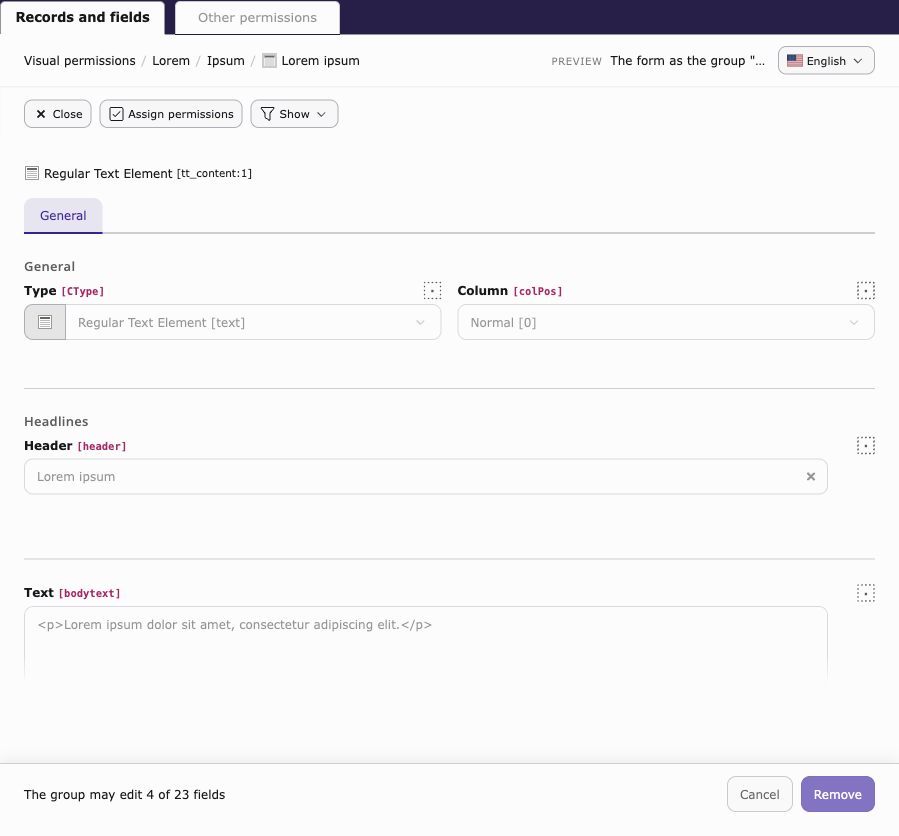
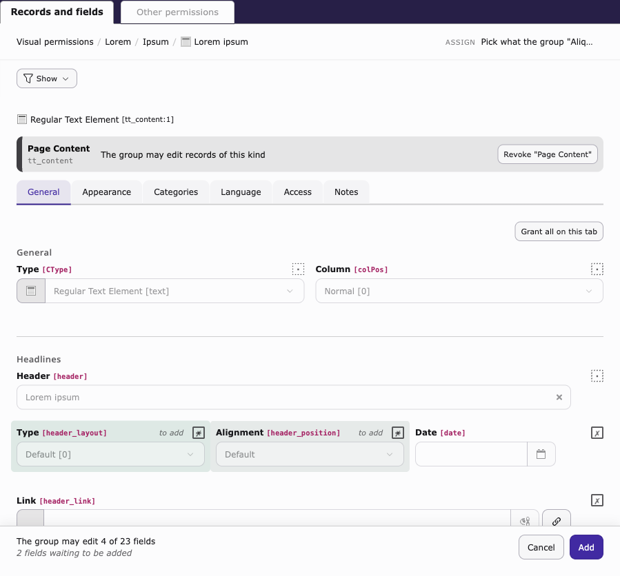
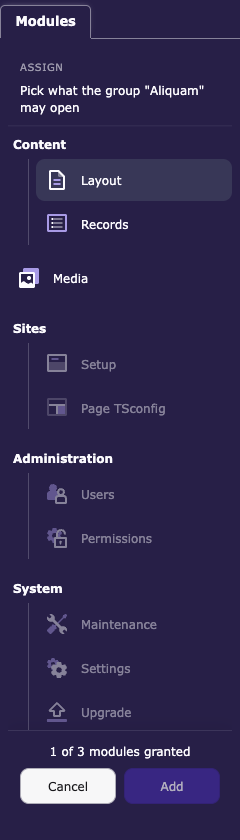
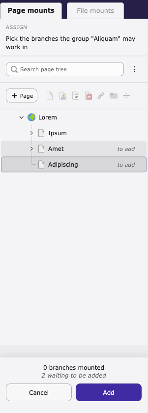
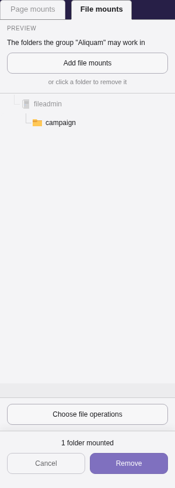
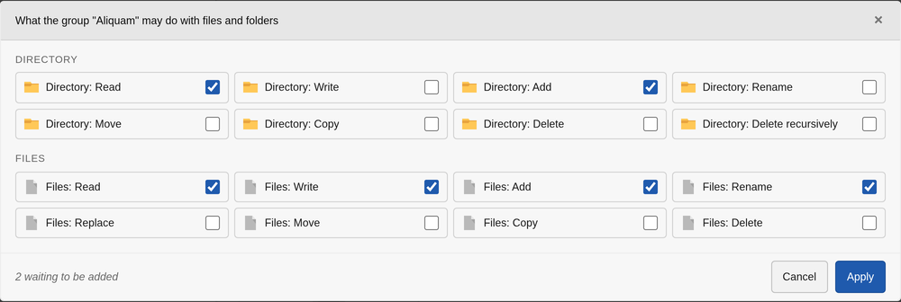
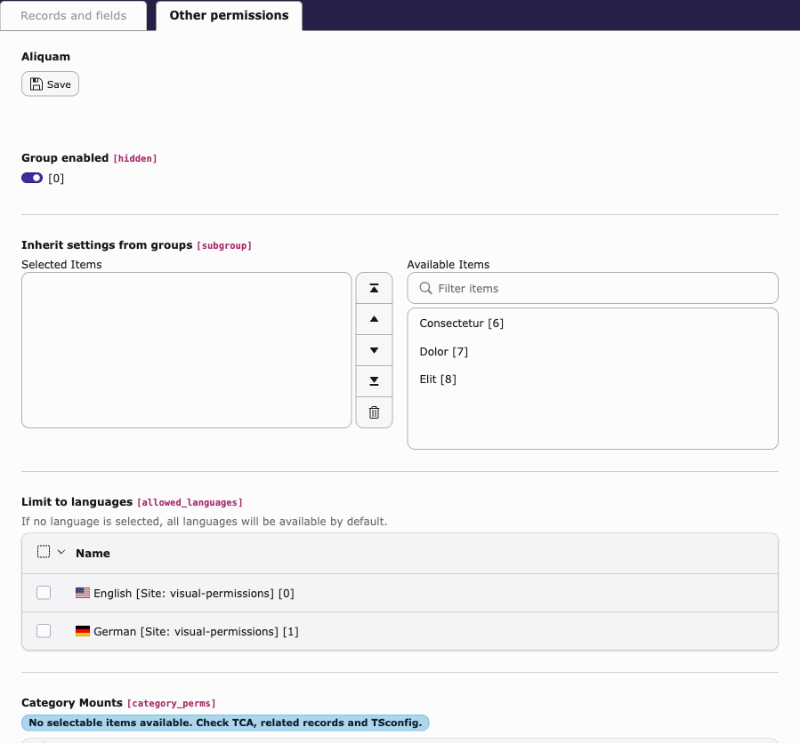
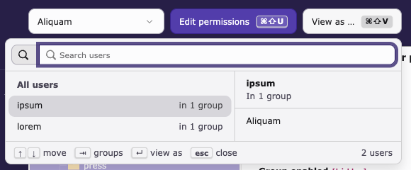
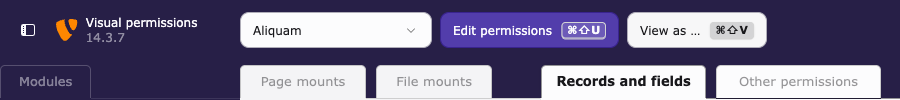

<p align="center"></p>

<h1 align="center">visual-permissions</h1>

<p align="center"><em>See and edit TYPO3 backend group permissions on the screens where they apply.</em></p>

[](https://github.com/wazum/visual-permissions/actions/workflows/checks.yml) [](https://github.com/wazum/visual-permissions/actions/workflows/mutation.yml) [](https://get.typo3.org) [](https://www.php.net) [](LICENSE)

## The idea

TYPO3 keeps the permissions of a backend group in one big record. You edit them there, far
away from the screens they change. A field that editors cannot see is only one entry in a
long list. The group can also get permissions from its subgroups.

This extension shows the permissions on the screens where they apply. Pick a group and
switch the view on. Each screen now shows what the group can do there, and you can change
it on the same screen.

## What it covers

| Area | What you see |
|------|--------------|
| Modules | The module menu shows the modules the group can open. |
| Page mounts | The page tree shows the pages the group can work in. |
| File mounts | The folder tree shows the folders the group can work in. |
| Records and fields | The record form shows what the group can do with each field, and if the group can edit records of this table at all. |
| Other permissions | The rest of the group record, in a panel next to the screen. |

Each area is like a card with two sides. The front shows what the group has. On the back,
you pick more. A permission the group gets from a subgroup is marked as inherited, and you
change it on that subgroup.

In the record form, point at a field's square or press it to read what it means. For an
inherited field, it names the groups that give it, and one press shows that group.

The extension saves nothing until you click to save. If TYPO3 does not accept a change, the
change stays on the screen with a message.

You can also open the backend as one of the group's users, and then go back to the screen
where you were.

> [!NOTE]
> The **Records and fields** area still has open problems in how it works for the user, so
> it can still change a lot.

## Screenshots

**Records and fields.** The front shows the form as the group gets it. On the back, you mark
the fields to give the group, and the band above the form says if the group may edit
records of this table.

| What the group has | What you give the group |
|---|---|
|  |  |

**Modules, page mounts and file mounts.** The module menu, the page tree and the folder tree
show what the group has, and you mark more on the same tree.

| Modules | Page mounts | File mounts |
|---|---|---|
|  |  |  |

**File operations.** What the group may do with files and folders holds for every file mount,
so it is chosen once, in a dialog opened from the foot of the File mounts panel.



**Other permissions.** The rest of the group record, next to the screen you are on.



**View as.** Open the backend as one of the users and come back to the screen where you
were.



## Getting started

The extension is in an early phase (alpha) and has no release yet. Install it from GitHub:

```bash
composer config repositories.visual-permissions vcs https://github.com/wazum/visual-permissions
composer require wazum/visual-permissions:dev-main
```

Log in as an administrator. The toolbar now has a group picker and a switch that shows the
permissions.



<kbd>Ctrl/Cmd</kbd> + <kbd>Shift</kbd> + <kbd>U</kbd> shows and hides the
permissions. <kbd>Ctrl/Cmd</kbd> + <kbd>Shift</kbd> + <kbd>V</kbd> switches to the user you
viewed last, and back again.

## Settings

You find these in the extension configuration:

| Setting | Default | What it does |
|---------|---------|--------------|
| `animation` | on | Turns the cards with an animation |
| `shortcut.toggle` | `u` | Key that shows and hides the permissions |
| `shortcut.switchUser` | `v` | Key that switches to the user you viewed last |
| `shortcut.show` | on | Shows the shortcuts on the buttons |

If you do not want a shortcut, leave its key empty.

## Licence

GPL-2.0-or-later
